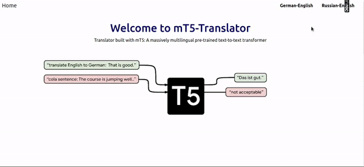
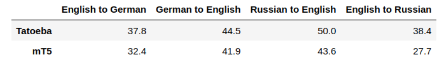

# mT5 Translator
###### This project was completed in Week 12 of the Data Science bootcamp at SPICED Academy.
In this project I built ***Deep Learning Translator*** using Transfer Learning approach. I used Hugging Face [mT5](https://huggingface.co/transformers/model_doc/mt5.html) Base model (multilingual pretrained text-to-text transformer model) and fine-tuned it on 4 downstream tasks (English-German, German-English, Russian-English, English-Russian) using data from
[The Tatoeba Translation Challenge](https://github.com/Helsinki-NLP/Tatoeba-Challenge). 
 
The model was trained in Google Colab using PyTorch.
 
Using the fine-tuned model, I created a simple Flask webapp and hosted it on Google Colab to visualize  the final results.

**Tools used:**
* PyTorch
* Hugging Face Transformers
* Colab
* Flask 
* Bootstrap

***BLEU score*** (compated to TATOEBA score)

